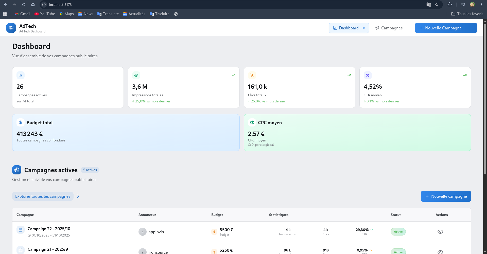
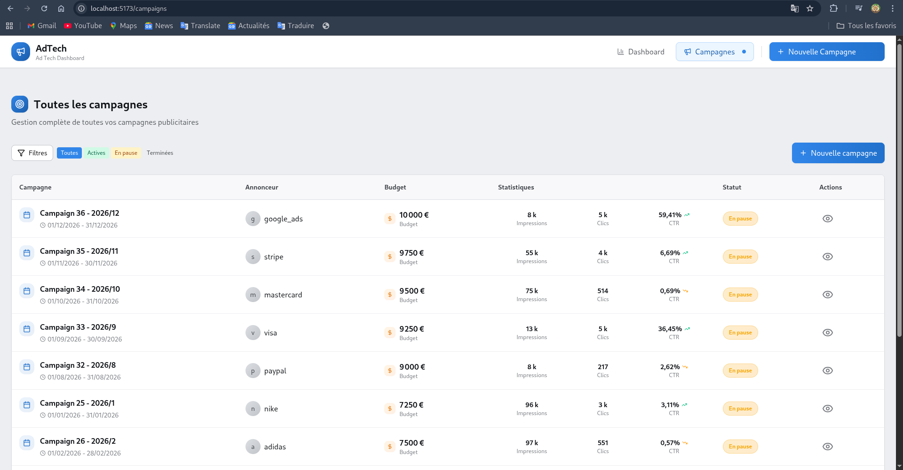
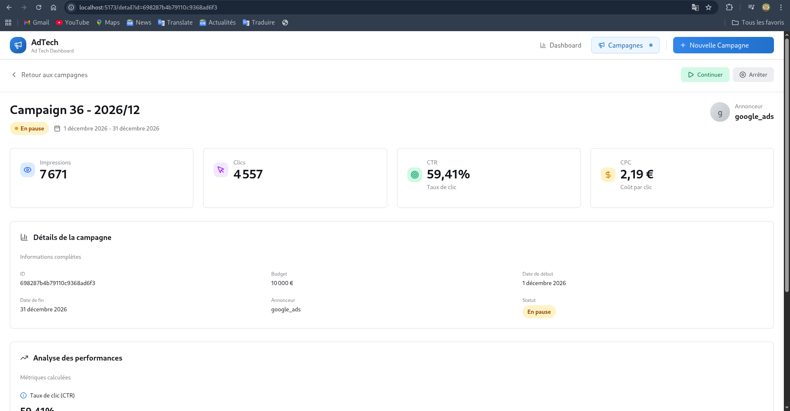
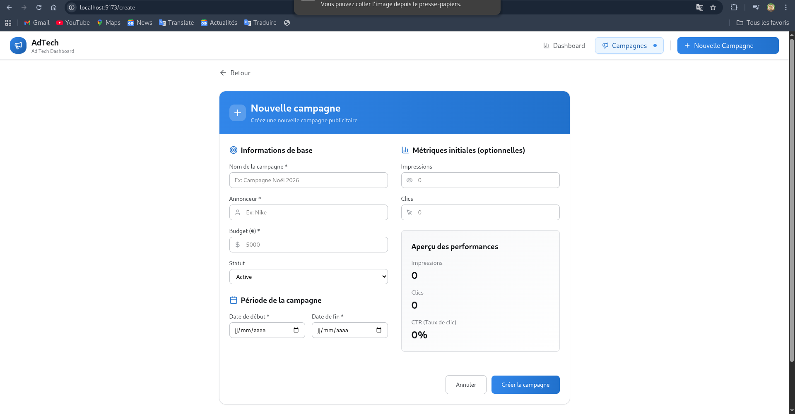

# AdTech Campaign Management Platform

## 📋 Overview

Une plateforme complète de gestion de campagnes publicitaires digitale pour le secteur AdTech. Cette solution permet aux annonceurs de créer, suivre et analyser les performances de leurs campagnes publicitaires sur différents supports (web, CTV).


## 🚀 Fonctionnalités

### Backend (NestJS + MongoDB)

- ✅ **API REST complète** avec validation des données
- ✅ **Modèle de données Campaign** avec tous les champs requis
- ✅ **Endpoints REST** :
  - `POST /api/campaigns` - Créer une campagne
  - `GET /api/campaigns` - Lister les campagnes avec pagination et filtres
  - `GET /api/campaigns/:id` - Détail d'une campagne
  - `PATCH /api/campaigns/:id/status` - Modifier le statut (active/paused/finished)
  - `GET /api/campaigns/:id/stats` - Statistiques (CTR, CPC)
  - `GET /api/campaigns/stats/overview` - Obtenir les statistiques globales
  - `GET /api/campaigns/stats/trends` - Obtenir les tendances mensuelles
- ✅ **Validation des données** avec class-validator
- ✅ **Architecture propre** (Controllers → Services → Models)
- ✅ **Pagination et filtres** avancés
- ✅ **Données de seed** pour le développement
- ✅ **Tests unitaires** avec Jest
- ✅ **Documentation Swagger** interactive

### Frontend (React 19 + TypeScript + TailwindCSS)

- ✅ **Dashboard complet** avec métriques clés :
  - Nombre de campagnes actives/total
  - Impressions totales avec évolution
  - Clics totaux avec évolution
  - CTR moyen avec évolution
  - Budget total
  - CPC moyen
- ✅ **Liste des campagnes** avec :
  - Filtres multi-critères (statut, date, budget)
  - Pagination
  - Vue compacte et détaillée
- ✅ **Création de campagne** avec formulaire complet
- ✅ **Détail campagne** avec :
  - Toutes les informations
  - Statistiques calculées en temps réel
  - Boutons d'action (activer/pause)
- ✅ **Interface utilisateur moderne et responsive** avec TailwindCSS 4
- ✅ **Gestion d'état avancée** avec TanStack Query (React Query)
- ✅ **Routing** avec React Router DOM 7
- ✅ **Notifications** avec React Toastify

## 🏗️ Architecture Technique

### Structure des Dossiers

```
📁 adtech-platform/
├── 📁 backend/                          # API NestJS v11
│   ├── src/
│   │   ├── campaigns/                   # Module principal des campagnes
│   │   │   ├── dtos/                    # Data Transfer Objects
│   │   │   ├── schemas/                 # Schémas Mongoose
│   │   │   ├── campaigns.controller.ts  # Contrôleur REST
│   │   │   ├── campaigns.module.ts      # Module NestJS
│   │   │   ├── campaigns.service.ts     # Logique métier
│   │   │   └── campaigns.controller.spec.ts # Tests
│   │   ├── common/                      # Utilitaires partagés
│   │   │   ├── filters/                 # Filtres d'exception
│   │   │   └── pipes/                   # Pipes de validation
│   │   ├── seeds/                       # Données de démonstration
│   │   │   ├── campaign.seed.ts         # Seed des campagnes
│   │   │   ├── seed.ts                  # Script principal
│   │   │   └── seeds.module.ts          # Module de seed
│   │   ├── test/                        # Tests e2e
│   │   ├── app.controller.ts            # Contrôleur racine
│   │   ├── app.module.ts                # Module racine
│   │   ├── app.service.ts               # Service racine
│   │   └── main.ts                      # Point d'entrée
│   ├── dist/                            # Fichiers compilés
│   ├── node_modules/
│   ├── Dockerfile                       # Configuration Docker
│   ├── package.json                     # Dépendances
│   └── README.md                        # Documentation backend
│
├── 📁 frontend/                        # Application React 19
│   ├── src/
│   │   ├── assets/                     # Images, polices
│   │   ├── components/                 # Composants réutilisables
│   │   │   ├── common/                 # Composants génériques
│   │   │   ├── dashboard/              # Composants dashboard
│   │   │   ├── campaigns/              # Composants campagnes
│   │   │   └── ui/                     # Composants d'interface
│   │   ├── contexts/                   # Context React
│   │   ├── hooks/                      # Hooks personnalisés
│   │   ├── layouts/                    # Layouts de page
│   │   ├── lib/                        # Bibliothèques utilitaires
│   │   ├── pages/                      # Pages de l'application
│   │   │   ├── Dashboard.tsx           # Page dashboard
│   │   │   ├── CampaignsList.tsx       # Liste des campagnes
│   │   │   ├── CampaignDetail.tsx      # Détail campagne
│   │   │   └── CreateCampaign.tsx      # Création campagne
│   │   ├── services/                   # Services API
│   │   ├── types/                      # Types TypeScript
│   │   ├── test/                       # Tests frontend
│   │   ├── App.css                     # Styles globaux
│   │   ├── App.tsx                     # Composant racine
│   │   ├── index.css                   # Styles d'entrée
│   │   └── main.tsx                    # Point d'entrée
│   ├── public/                         # Fichiers statiques
│   ├── node_modules/
│   ├── Dockerfile                      # Configuration Docker
│   ├── package.json                    # Dépendances
│   └── README.md                       # Documentation frontend
│
├── docker-compose.yml                  # Orchestration Docker
├── .env.example                        # Variables d'environnement
└── README.md                           # Documentation principale
```

## 🛠️ Stack Technique - Versions détaillées

### Backend (NestJS v11)

```
NestJS 11.0.1          - Framework backend TypeScript
Mongoose 9.1.5         - ODM pour MongoDB
TypeScript 5.7.3       - Superset JavaScript typé
Jest 30.0.0            - Framework de tests
Swagger 11.2.5         - Documentation API interactive
class-validator 0.14.3 - Validation des données
Helmet 8.1.0           - Sécurité HTTP
```

### Frontend (React 19)

```
React 19.2.0           - Bibliothèque UI moderne
TypeScript 5.9.3       - Typage statique
Vite 7.2.4             - Build tool ultra-rapide
TailwindCSS 4.1.18     - Framework CSS utilitaire
TanStack Query 5.90.20 - Gestion d'état serveur
React Router 7.13.0    - Navigation SPA
date-fns 4.1.0         - Manipulation de dates
Lucide React 0.563.0   - Icônes modernes
Axios 1.13.4           - Client HTTP
React Toastify 11.0.5  - Notifications
```

### Infrastructure

```
Docker 20.10+          - Conteneurisation
Docker Compose 2.0+    - Orchestration multi-conteneurs
MongoDB 7.0+           - Base de données NoSQL
Node.js 18+            - Runtime JavaScript
```

## 🚀 Installation & Démarrage

### Prérequis

- Docker 20.10+ et Docker Compose 2.0+
- Git

### 1. Clone du projet

```bash
git clone <repository-url>
cd ad-tech-test
```

### 2. Configuration de l'environnement

```bash
# Copier les variables d'environnement
cp .env.example .env
```

### 3. Lancement avec Docker Compose

```bash
# Démarrer tous les services en arrière-plan
docker-compose up -d --build

# Suivre les logs en temps réel
docker-compose logs -f

# Arrêter tous les services
docker-compose down

# Arrêter et nettoyer les volumes
docker-compose down -v

# Redémarrer un service spécifique
docker-compose restart backend
```

### 4. Services disponibles

- **Frontend React** : http://localhost:5173/
- **Backend API** : http://localhost:3001/api
- **Documentation API Swagger** : http://localhost:3001/api/docs
- **Base de données MongoDB** : localhost:27017

### 5. Initialisation des données

```bash
# Générer des campagnes de démonstration
docker-compose exec backend npm run seed

# Vérifier les données insérées
docker-compose exec mongodb mongo adtech --eval "db.campaigns.count()"
```

## 📊 Structure des Données

### Modèle Campaign (Mongoose Schema v9)

```typescript
{
  _id: ObjectId,                    // Identifiant unique
  name: string,                     // Nom de la campagne
  advertiser: string,               // Nom de l'annonceur
  budget: number,                   // Budget total en euros
  startDate: Date,                  // Date de début
  endDate: Date,                    // Date de fin
  status: 'active' | 'paused' | 'finished',
  impressions: number,              // Nombre d'impressions
  clicks: number,                   // Nombre de clics
  description?: string,             // Description optionnelle
  targetAudience?: string,          // Audience cible
  platforms?: string[],             // Plateformes de diffusion
  createdAt: Date,                  // Date de création auto
  updatedAt: Date                   // Date de modification auto
}
```

### Métriques Calculées

- **CTR (Click-Through Rate)** : `(clicks / impressions) * 100` en %
- **CPC (Cost Per Click)** : `budget / clicks` en € (si clicks > 0)
- **Budget dépensé** : Calcul proportionnel à la durée écoulée
- **Performance** : Évolution vs période précédente en %
- **Budget restant** : Budget total - budget dépensé

## 🎯 Captures d'écran

### Dashboard Principal


_Tableau de bord avec KPI, tendances et visualisations utilisant React 19 et TailwindCSS 4_

### Liste des Campagnes


_Tableau interactif avec filtres multi-critères et pagination utilisant TanStack Query_

### Détail d'une Campagne


_Vue détaillée avec statistiques, historique et contrôles utilisant React Router 7_

### Création de Campagne


_Formulaire avec validation en temps réel et prévisualisation utilisant React Hook Form_

## 🔍 Choix Techniques Détaillés

### Backend - NestJS v11

- **Architecture modulaire** : Séparation claire des responsabilités avec les modules NestJS
- **DTOs avec validation** : Utilisation de `class-validator` v0.14.3 pour la validation robuste
- **Mongoose v9** : Support natif TypeScript avec schémas typés
- **Swagger intégré** : Documentation API auto-générée avec annotations decorators
- **Helmet pour la sécurité** : Headers HTTP sécurisés configurés
- **Tests Jest** : Couverture complète des contrôleurs et services

### Frontend - React 19 + Vite

- **React 19 avec nouvelles APIs** : Utilisation des dernières fonctionnalités React
- **TanStack Query v5** : Gestion avancée du cache, revalidation automatique
- **TailwindCSS v4** : Build plus rapide, nouvelles fonctionnalités CSS
- **Vite pour le build** : Développement ultra-rapide avec HMR
- **TypeScript strict** : Typage complet pour éviter les bugs
- **Architecture modulaire** : Composants réutilisables et séparation des préoccupations

### Performance Optimisations

- **Lazy loading** des routes avec React Router
- **Code splitting** automatique avec Vite
- **Cache agressif** avec TanStack Query
- **Images optimisées** avec Vite
- **Bundle analysis** intégré

## 🧪 Tests

### Backend Tests (Jest)

```bash
# Exécuter tous les tests unitaires
docker-compose exec backend npm run test

# Tests avec couverture de code
docker-compose exec backend npm run test:cov

# Mode watch pour le développement
docker-compose exec backend npm run test:watch

# Tests e2e
docker-compose exec backend npm run test:e2e
```

### Frontend Tests

```bash
# Pour exécuter les tests frontend (si configurés)
docker-compose exec frontend npm run test
```

## 🔧 Développement Local (sans Docker)

### Backend

```bash
cd backend

# Installer les dépendances
npm install

# Configurer l'environnement
cp .env.example .env
# Modifier MONGODB_URI pour pointer vers MongoDB local

# Démarrer MongoDB localement (si non Docker)
# sudo systemctl start mongod (Linux)
# brew services start mongodb-community (Mac)

# Démarrer en mode développement
npm run start:dev

# Accéder à l'API : http://localhost:3001
# Swagger : http://localhost:3001/api/docs
```

### Frontend

```bash
cd frontend

# Installer les dépendances
npm install

# Démarrer le serveur de développement
npm run dev

# Accéder à l'application : http://localhost:5173
```

## 📝 Documentation API

### Endpoints Principaux

#### Campagnes

```
GET    /api/campaigns                  - Lister toutes les campagnes
POST   /api/campaigns                  - Créer une nouvelle campagne
GET    /api/campaigns/:id              - Obtenir une campagne par ID
PATCH  /api/campaigns/:id              - Mettre à jour une campagne
PATCH  /api/campaigns/:id/status       - Modifier le statut
GET    /api/campaigns/:id/stats        - Obtenir les statistiques
GET    /api/campaigns/stats/overview   - Statistiques globales
GET    /api/campaigns/stats/trends     - Tendances mensuelles
```

#### Paramètres de requête supportés

```
status        : active, paused, finished
advertiser    : Filtre par annonceur
startDate     : Date de début minimum
endDate       : Date de fin maximum
minBudget     : Budget minimum
maxBudget     : Budget maximum
page          : Numéro de page (défaut: 1)
limit         : Résultats par page (défaut: 10)
sortBy        : Champ de tri (name, budget, startDate, etc.)
sortOrder     : asc ou desc
```

### Exemples cURL

```bash
# Créer une campagne
curl -X POST http://localhost:3001/api/campaigns \
  -H "Content-Type: application/json" \
  -d '{
    "name": "Campagne Printemps 2024",
    "advertiser": "EcoBrand",
    "budget": 25000,
    "startDate": "2024-03-01",
    "endDate": "2024-06-30",
    "description": "Campagne éco-responsable"
  }'

# Lister avec filtres
curl "http://localhost:3001/api/campaigns?status=active&page=1&limit=5"

# Statistiques globales
curl "http://localhost:3001/api/campaigns/stats/overview"
```

## 📈 Roadmap & Améliorations Futures

### Phase 2 - Court terme (Q1 2024)

- [ ] **Authentification JWT** avec rôles (admin, advertiser, viewer)
- [ ] **Cache Redis** pour les données fréquemment accédées
- [ ] **Export CSV/PDF** des rapports
- [ ] **Notifications temps réel** avec WebSockets
- [ ] **Dashboard personnalisable** avec widgets drag & drop

### Phase 3 - Moyen terme (Q2-Q3 2024)

- [ ] **Microservices architecture** :
  - Service Campaigns (gestion des campagnes)
  - Service Analytics (traitement des données)
  - Service Billing (gestion financière)
  - Service Notifications (communications)
- [ ] **Pipeline ETL** pour ingestion de données de tracking
- [ ] **Machine Learning** pour prédiction des performances
- [ ] **A/B Testing intégré** avec analyse statistique
- [ ] **API GraphQL** en parallèle de REST

### Phase 4 - Long terme (Q4 2024+)

- [ ] **Architecture event-driven** avec Apache Kafka
- [ ] **Data Warehouse** ClickHouse pour analytique temps réel
- [ ] **Multi-tenancy** pour agences avec isolation des données
- [ ] **Intégrations DSP/SSP** via APIs tierces (Google Ads, Facebook, etc.)
- [ ] **Mobile App** React Native
- [ ] **CI/CD automatisé** avec tests de performance

### Améliorations Produit AdTech

1. **Attribution multi-touch** : Modèles d'attribution avancés
2. **ROAS tracking** : Retour sur investissement par canal
3. **Audience segmentation** : Création de segments dynamiques
4. **Bid optimization** : Optimisation automatique des enchères
5. **Creative testing** : Test automatique des visuels
6. **Budget pacing** : Répartition intelligente du budget
7. **Fraud detection** : Détection de trafic non humain
8. **Cross-device tracking** : Suivi utilisateur multi-appareils

## 👥 Guide de Contribution

1. **Fork** le repository
2. **Créer une branche** : `git checkout -b feature/nouvelle-fonctionnalite`
3. **Commit atomique** : `git commit -m 'feat: ajout fonctionnalité X'`
4. **Push** : `git push origin feature/nouvelle-fonctionnalite`
5. **Ouvrir une Pull Request** avec description détaillée

### Convention de commits

- `feat:` Nouvelle fonctionnalité
- `fix:` Correction de bug
- `docs:` Documentation
- `style:` Formatage, style de code
- `refactor:` Refactorisation sans changement fonctionnel
- `test:` Ajout ou modification de tests
- `chore:` Tâches de maintenance, dépendances

### Standards de code

- **TypeScript strict** pour le typage
- **ESLint** avec règles NestJS/React
- **Prettier** pour le formatage
- **Tests unitaires** pour toute nouvelle fonctionnalité
- **Documentation** mise à jour

## 🐛 Dépannage

### Problèmes courants

#### MongoDB ne démarre pas

```bash
# Vérifier les logs
docker-compose logs mongodb

# Redémarrer le service
docker-compose restart mongodb

# Vérifier l'espace disque
docker system df

# Supprimer le volume et réessayer
docker-compose down -v
docker-compose up -d mongodb
```

#### Backend en erreur de connexion MongoDB

```bash
# Vérifier les variables d'environnement
docker-compose exec backend printenv | grep MONGODB

# Tester la connexion MongoDB
docker-compose exec mongodb mongosh --eval "db.adminCommand('ping')"

# Reconstruire le backend
docker-compose up -d --build backend
```

#### Frontend ne se connecte pas à l'API

```bash
# Vérifier les variables d'environnement frontend
docker-compose exec frontend cat /app/.env

# Tester la santé de l'API
curl http://localhost:3001/api/health

# Vérifier les logs CORS
docker-compose logs backend | grep -i cors

# Vérifier la connectivité réseau
docker-compose exec frontend curl -I http://backend:3001
```

#### Problèmes de build

```bash
# Nettoyer les caches
docker-compose down -v
docker system prune -a
docker volume prune

# Reconstruire complètement
docker-compose build --no-cache
docker-compose up -d
```
